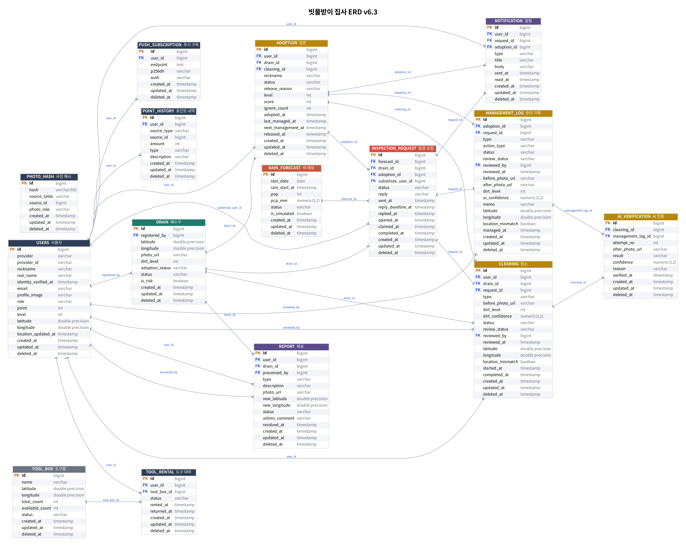

# 빗물받이 집사 ERD (v6.3 · 최종 확정)

- 원본: [`erd.dbml`](./erd.dbml) → [dbdiagram.io](https://dbdiagram.io/d)에 붙여넣으면 그림으로 보인다
- PostgreSQL DDL: [`schema.sql`](./schema.sql) (PostgreSQL 16에서 생성 확인)
- 그림: `erd.png`
- `❓` = 팀 확정 필요



## 타입 규칙

| 항목 | PostgreSQL | Java |
| --- | --- | --- |
| 위도·경도 | `double precision` | `Double` |
| 시각 | `timestamp` (한국 시간) | `LocalDateTime` |
| 더러움 단계 | `integer` 1~3 | `Integer` |
| AI 확신도 | `numeric(3,2)` | `BigDecimal` |

## v6.2 → v6.3

- `users`: `real_name`, `identity_verified_at`, `location_updated_at`
- `photo_hash` 테이블 추가 (같은 사진 재사용 차단)
- `cleaning`·`management_log`: `review_status`, `reviewed_by`, `reviewed_at` (시청 검토)
- `management_log.action_type` (살펴보기 / 청소까지)
- `ai_verification.management_log_id` (관리 기록도 AI 재시도) - `cleaning_id`와 둘 중 하나만
- `report.new_latitude/new_longitude` (위치 수정 제보)
- 시각 `timestamptz` → `timestamp`, `dirt_level` `smallint` → `integer` (JPA 스키마 검증과 타입 맞춤)

## 공통 컬럼 (BaseEntity)

모든 테이블에 `created_at`, `updated_at`, `deleted_at`이 있다 → `com.rainbutler.global.common.BaseEntity`를 상속.
- `created_at`, `updated_at`: JPA Auditing이 자동으로 채움
- `deleted_at`: 소프트 삭제. 조회에서 빼려면 엔티티에 `@SQLRestriction("deleted_at IS NULL")`

## 위험 배수구

`drain.is_risk` - 현장 조사 때 배수구를 등록하면서 직접 지정한다 (자동 지정 없음).
비 예보 때 입양자가 없는 위험 배수구도 점검 요청을 만들고(`adoption_id` = null), 바로 대신 점검으로 공개한다.

## 핵심 흐름

**입양**: 청소(`cleaning`, type=ADOPTION) → 비포 사진 AI 더러움 판정(1~3) → 애프터 사진 AI 인증(`ai_verification`, 실패 시 재시도) → 통과하면 `adoption` 생성 (`cleaning_id`로 연결)
- 사용자당 ACTIVE 입양 최대 3개 → 서비스 로직
- 배수구당 ACTIVE 입양 1개 → `UNIQUE (drain_id) WHERE status='ACTIVE'`

**정기 점검**: 입양자가 `management_log`(type=REGULAR)에 기록 → `adoption.last_managed_at` = 점검일, `next_management_at` = 점검일 + 14일
- 매일 배치: `last_managed_at`이 28일 지나면 경고 알림, 35일 지나면 `status=RELEASED`, `release_reason=AUTO`
- 주기(14일·35일)는 DB가 아니라 설정 값

**비 예보**: 비 오기 전날 06:00 입양자 전원에게 일괄 알림 → 20:00까지 응답 → 불가·무응답이면 대신 점검으로 공개
- 입양자가 하면 `management_log.request_id`(type=RAIN), 대신 점검이면 `cleaning.request_id`(type=SUBSTITUTE)로 완료 연결

```
SENT ─(가능)→ ACCEPTED ─(점검)→ COMPLETED
  ├─(불가)─────────┐
  └─(20:00 무응답)─┴→ OPEN ─(수락)→ CLAIMED ─(점검)→ COMPLETED
마감까지 못 하면 MISSED / 비 취소 → CANCELLED
```

**도구함**: `tool_box` 1:N `tool_rental` N:1 `users`. 대여 시 `tool_rental` 생성 + `available_count - 1` (0이면 `ALL_RENTED`), 반납 시 `RETURNED` + `+1`
- 1인 1개만 대여: `UNIQUE (user_id) WHERE status='RENTED'`
- 빌린 도구함에만 반납 (서비스 로직)
- 동시 대여 방지: `UPDATE tool_box SET available_count = available_count - 1 WHERE id=? AND available_count > 0`
